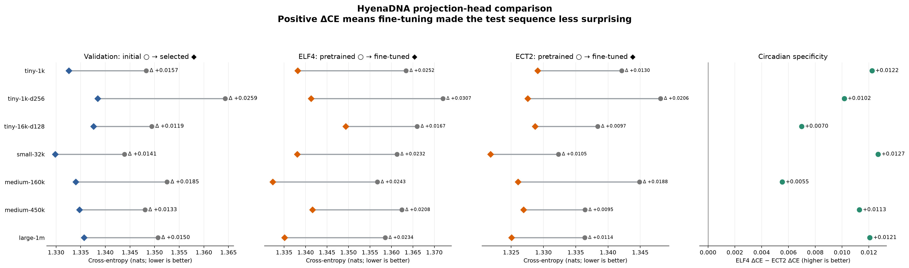
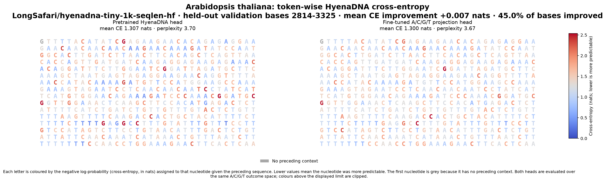
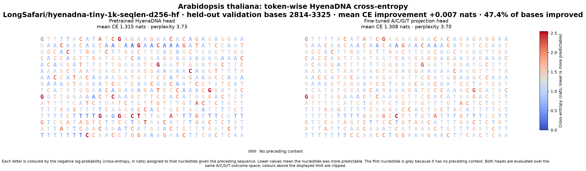
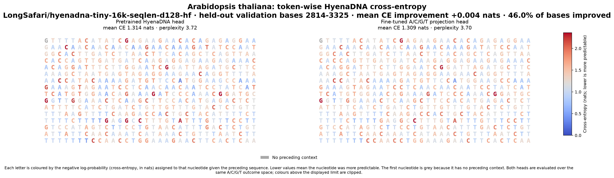
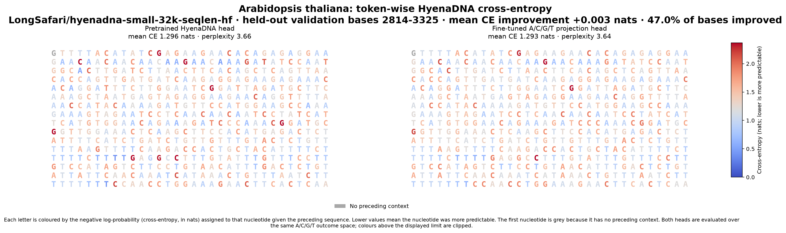
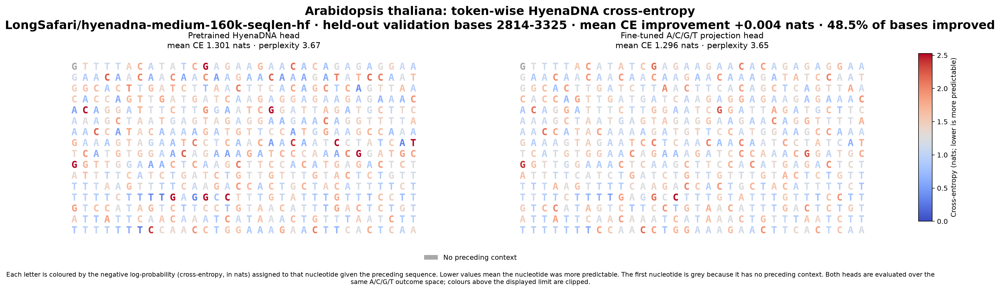
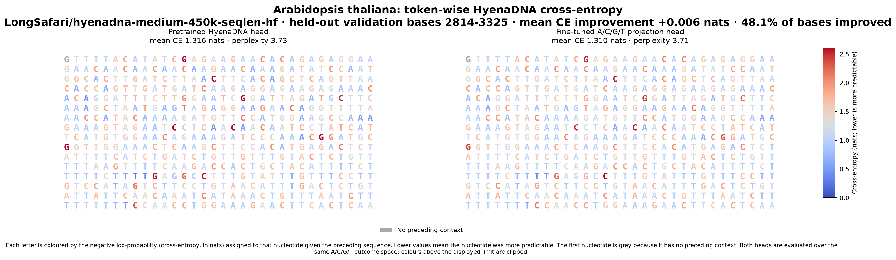
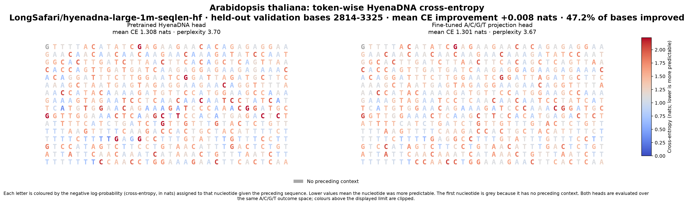

# HyenaDNA projection-head training and evaluation

This directory adapts several pretrained HyenaDNA backbones to the nucleotide
distribution of a small *Arabidopsis thaliana* circadian-gene dataset. Only a
new A/C/G/T output projection is trained: the HyenaDNA backbone remains frozen.
The experiment therefore asks how much can be gained by recalibrating the final
next-base decision without changing the sequence representation learned by the
original model.

The dataset and the reasons for choosing its training, validation, and test
genes are described in [dataset.md](dataset.md).

## From the original vocabulary to four bases

The original HyenaDNA language-model head produces one logit for every token in
its vocabulary. That vocabulary contains A, C, G, and T, but also tokens that
are not valid outcomes in this experiment, such as tokenizer control or special
tokens. The fine-tuned head is instead a bias-free linear layer with exactly
four rows, in the fixed order `A`, `C`, `G`, `T`:

```text
HyenaDNA hidden state h_t -> Linear(d_model, 4) -> [z_A, z_C, z_G, z_T]
```

By default, each of these four rows is copied from the corresponding row of the
pretrained language-model head. Epoch 0 is consequently the pretrained
A/C/G/T projection before any optimisation. `--initialization random` is also
available, but it changes that interpretation and is not used by the standard
cross-model run.

This is a change from the project's earlier procedure, which trained a
randomly initialised four-way head. A random head asks whether a new classifier
can be learned on top of frozen HyenaDNA representations. The current procedure
instead fine-tunes the existing model's own A/C/G/T output rows. It preserves
the pretrained next-base predictor as the starting point, requires training to
make only an incremental adjustment, and supplies a meaningful epoch-0 baseline
for deciding whether the adjustment helped.

Softmax over the four logits renormalises the distribution to the four
canonical bases. For a base $b$,

```math
p_4(b\mid h_t) =
\frac{\exp z_b}{\sum_{c\in\{A,C,G,T\}}\exp z_c}
=
\frac{p_{\mathrm{vocab}}(b\mid h_t)}
{\sum_{c\in\{A,C,G,T\}}p_{\mathrm{vocab}}(c\mid h_t)}.
```

This is a conditional distribution given that the next token is one of A/C/G/T.
It is not the original model's full-vocabulary probability. This distinction is
important when reporting cross-entropy or perplexity: the values in this study
belong to the four-outcome next-base task and should not be compared directly
with full-vocabulary language-model perplexities.

Fine-tuning updates only this four-row matrix. During training, labels are
remapped from tokenizer IDs to classes 0--3; any non-nucleotide token is assigned
the cross-entropy ignore index. For a fair baseline at test time, the original
head is treated in exactly the same way: its A/C/G/T columns are selected before
cross-entropy applies softmax. Thus both heads compete over the same four
outcomes and differ only in their projection weights.

## Training procedure

[`train_projection_head.py`](train_projection_head.py) performs the following
steps.

1. It reads each FASTA record independently, accepts only A/C/G/T, and never
   creates a window across a record boundary.
2. It reserves a contiguous tail of each sufficiently long training record for
   validation. The tail length is the larger of one window and the requested
   validation fraction (defaults: 512 bases and 10%). A record too short to
   retain a full training window and a separate validation window contributes
   only to training. At least one record must still supply validation data.
3. It makes sliding training windows, runs them through the frozen HyenaDNA
   backbone, and optimises only the four-way projection using AdamW and
   next-token cross-entropy. The command-line defaults are batch size 8, 40
   epochs, learning rate $10^{-4}$, window size 512, and stride 1. The batch
   script uses stride 16 to reduce the number of heavily overlapping windows.
4. It evaluates the validation tails after every epoch. Every nucleotide after
   the first in each tail is scored exactly once; overlapping inference windows
   provide left context but do not duplicate observations. The combined loss is
   therefore weighted by the number of bases, not by the number of windows or
   genes.
5. It restores and saves the checkpoint with the lowest validation
   cross-entropy, then evaluates the independent test files. These tests are not
   consulted during optimisation or checkpoint selection.

Epoch 0 is evaluated before training and retained as a checkpoint candidate.
Its loss is also persisted in the metrics JSON as `initial_validation_ce`.
With pretrained initialisation, this guarantees that the selected head cannot
be worse on validation than the original A/C/G/T rows under the same
four-class normalisation: if no training epoch improves on epoch 0, the
unchanged epoch-0 projection is saved. A positive
`initial_validation_ce - best_validation_ce` demonstrates a strict validation
improvement; equality means that training did not beat the baseline and the
original projection was retained.

### Validation, learning-rate scheduling, and stopping

Two controls respond independently to validation cross-entropy:

- `ReduceLROnPlateau` monitors validation loss in `min` mode. By default, after
  a plateau patience of 2 it multiplies the learning rate by 1/3, down to a
  minimum of $10^{-6}$. An absolute improvement must exceed $10^{-6}$.
- The early-stopping counter resets only when validation loss improves the best
  value by more than $10^{-6}$. It stops training after 8 consecutive
  non-improving epochs by default.

The two patience values deliberately operate at different timescales: the
scheduler gets opportunities to take smaller steps before early stopping ends
the run. `best_validation_ce` is the score of the restored and saved checkpoint;
`final_validation_ce` is the score observed in the last epoch actually run, so
the two need not be equal.

The held-out files have two distinct roles. ELF4 tests transfer to an unseen
circadian-clock gene, whereas ECT2 is a non-circadian control. An improvement on
both may indicate general *Arabidopsis* recalibration; a larger improvement on
ELF4 is more consistent with circadian-specific transfer. The present control
set is small, so this difference is evidence for comparison rather than a
standalone biological conclusion.

## Reproducible runs, logs, and structured metrics

To train all seven supported HyenaDNA variants sequentially, run from the
repository root:

```bash
training/train_hyenadna_models.sh
```

The script uses the pinned model revisions in
[`hyenadna_models.py`](hyenadna_models.py), the same FASTA inputs and
hyperparameters for every backbone, and `--stride 16`. It writes:

- projection checkpoints to `training/heads/*.pt`;
- one plain-text run log per model to `training/runs/*.log`; and
- one machine-readable record per model to
  `training/runs/*.metrics.json`.

The `--log-file` output mirrors ordinary messages and uncaught errors while
leaving transient `tqdm` redraws out of the saved log. It contains the input
records, split sizes, model revision, device, per-epoch train and validation
losses, predicted validation base distribution, learning-rate changes,
checkpoint decisions, generated sample, and independent test summaries.

The metrics JSON is the stable comparison interface. It records the model and
revision, checkpoint path and training files, best epoch and completed epochs,
the epoch-0 baseline as `initial_validation_ce`, the selected checkpoint as
`best_validation_ce`, the last observed epoch as `final_validation_ce`, the
derived `validation_ce_improvement`, and the validation scored-base count. The
explicit epoch-0 value makes the no-regression guarantee auditable after the
run rather than dependent on the transient console output. It also records
these per-test-file values:

```text
gene, scored_bases,
pretrained_ce, pretrained_perplexity,
fine_tuned_ce, fine_tuned_perplexity,
ce_improvement
```

Here `ce_improvement = pretrained_ce - fine_tuned_ce`, so a positive value
favours the fine-tuned head.

After the runs complete, build the common table and plot with:

```bash
uv run python -m training.compare_hyenadna_models
```

[`compare_hyenadna_models.py`](compare_hyenadna_models.py) discovers every
`*.metrics.json` file in `training/runs/`, checks the required fields, orders
known models consistently, and writes:

- [`hyenadna_model_metrics.md`](study/models/hyenadna_model_metrics.md), a
  readable summary table;
- [`hyenadna_model_metrics.csv`](study/models/hyenadna_model_metrics.csv), the
  fuller analysis table; and
- `study/models/hyenadna_model_comparison.png`, the overview below.

The final panel uses the specificity margin
`ELF4 ce_improvement - ECT2 ce_improvement`; a positive value means the
fine-tuning benefit was greater on the held-out circadian gene.



## Token-wise cross-entropy in `xent.py`

[`xent.py`](xent.py) visualises where the base and fine-tuned heads find a
sequence surprising. For target nucleotide $x_t$, it computes

$$
\mathrm{CE}_t = -\log p_4(x_t\mid x_{<t}).
$$

The backbone processes the same input window once. Two projections are then
applied to the resulting hidden states:

- **pretrained:** apply the original output head, select only its A/C/G/T
  logits, and renormalise through four-class cross-entropy;
- **fine-tuned:** apply the saved four-row projection and use the same
  cross-entropy labels.

This paired construction controls for the input, context, hidden state, target,
and outcome space. The reported per-position improvement is
`base CE - fine-tuned CE`; the figure also gives the mean improvement and the
fraction of scored bases with a positive improvement. Perplexity is
`exp(mean CE)`.

Long regions are processed in overlapping windows. The overlap supplies prior
context, but a cursor ensures that each target is written exactly once. Position
1 is left grey/`NaN`, since it has no preceding nucleotide within the selected
region. Both panels share a colour scale, clipped at the requested percentile,
so their colours are directly comparable.

With no arguments, the script discovers all model-derived `.pt` files in
`training/heads`, infers the corresponding backbone from each filename, uses
the held-out validation tail of CCA1, and creates one plot per head:

```bash
uv run python -m training.xent
```

The validation-tail default matches the trainer's contiguous split. Options
such as `--fasta`, `--evaluation-region`, `--context-size`, and
`--validation-fraction` must be kept consistent with the training setup when a
like-for-like analysis is intended.

### Cross-entropy figures by model

#### tiny-1k



#### tiny-1k-d256



#### tiny-16k-d128



#### small-32k



#### medium-160k



#### medium-450k



#### large-1m



Together, the aggregate comparison and token-wise views answer complementary
questions. The metrics JSON and model-comparison plot show whether an entire
sequence improves and whether that improvement is specific to ELF4 relative to
ECT2. The `xent.py` plots show which individual nucleotide predictions account
for the mean change.

## AI attribution

The training and summaries documented here were produced using GPT-5.6-Sol
(medium reasoning effort).
